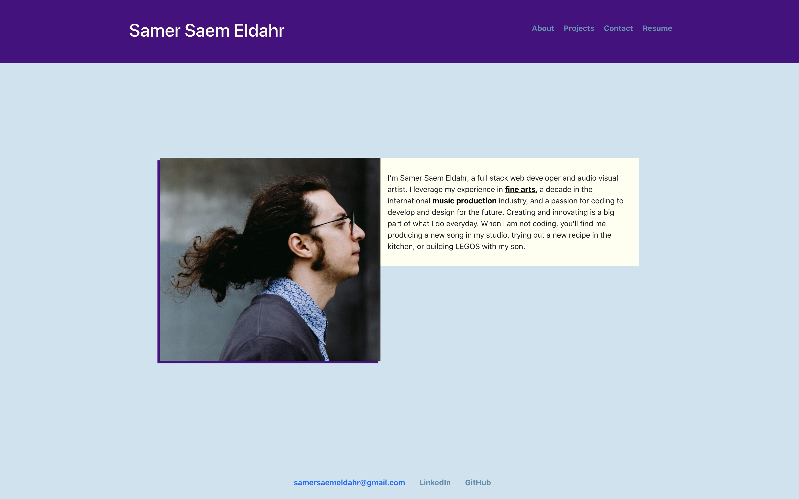
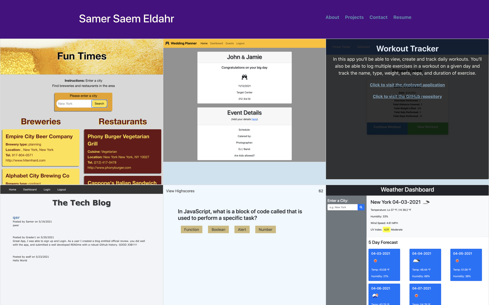
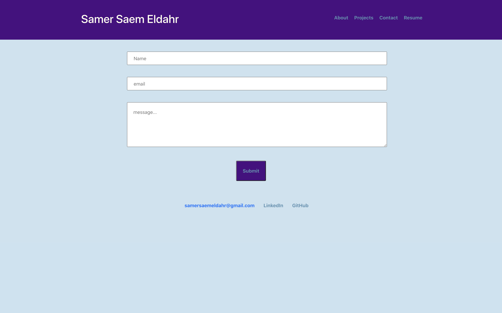
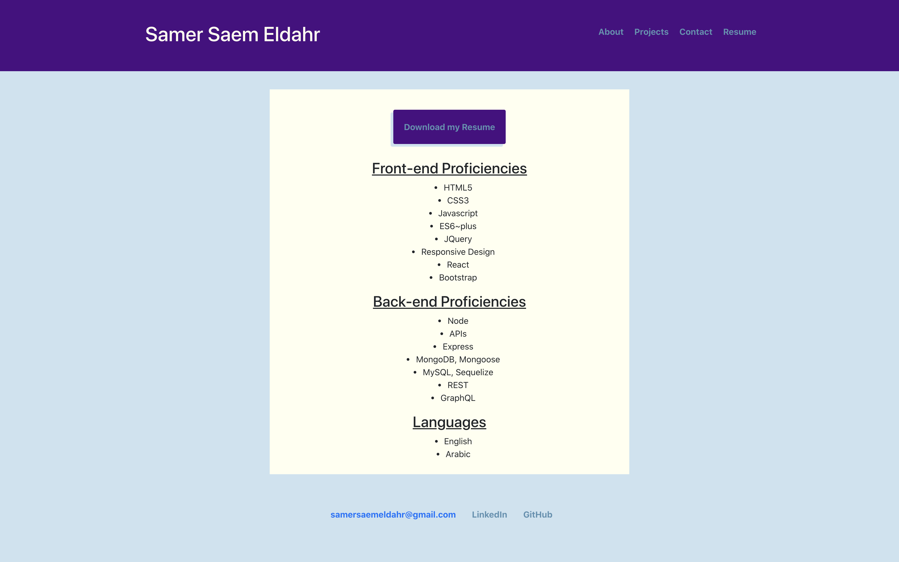

# React Portfolio

This website showcases my skills and projects with a little introduction about me and a way to connect.

## Table of Contents

1. [Links](#Links)
2. [License](#License)
3. [Questions](#Questions) 

## Links

* [Deployed application](https://samersaemeldahr.github.io/React-Portfolio/)
* [Github Repository](https://github.com/samersaemeldahr/React-Portfolio)

## License

This application is covered under MIT License [More information about about the license](https://choosealicense.com/licenses/mit/)

## Questions
Please feel free to reach out with any questions via [email](mailto:samersaemeldahr@gmail.com) or [GitHub](https://www.github.com/samersaemeldahr)
